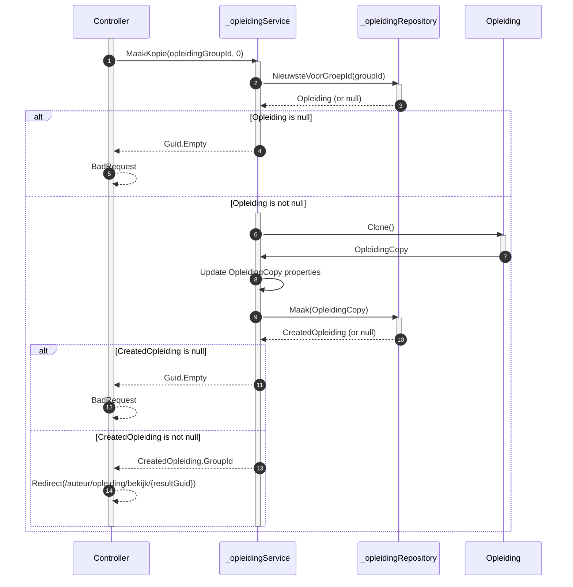

# Kopieëren opleiding

```mermaid
sequenceDiagram
    autonumber
    activate Controller
    Controller ->> _opleidingService: MaakKopie(opleidingGroupId, 0)
    activate _opleidingService
    _opleidingService ->> _opleidingRepository: NieuwsteVoorGroepId(groupId)
    activate _opleidingRepository
    _opleidingRepository -->> _opleidingService: Opleiding (or null)
    deactivate _opleidingRepository
    alt Opleiding is null
        _opleidingService -->> Controller: Guid.Empty
        deactivate _opleidingService
        Controller -->> Controller: BadRequest
    else Opleiding is not null
        activate _opleidingService
        _opleidingService ->> Opleiding: Clone()
        activate Opleiding
        Opleiding ->> _opleidingService: OpleidingCopy
        deactivate Opleiding
        _opleidingService ->> _opleidingService: Update OpleidingCopy properties
        _opleidingService ->> _opleidingRepository: Maak(OpleidingCopy)
        activate _opleidingRepository
        _opleidingRepository -->> _opleidingService: CreatedOpleiding (or null)
        deactivate _opleidingRepository
        alt CreatedOpleiding is null
            _opleidingService -->> Controller: Guid.Empty            
            Controller -->> Controller: BadRequest
        else CreatedOpleiding is not null
            _opleidingService -->> Controller: CreatedOpleiding.GroupId            
            Controller -->> Controller: Redirect(/auteur/opleiding/bekijk/{resultGuid})
            
        end
        deactivate _opleidingService
        deactivate Controller
    end
```