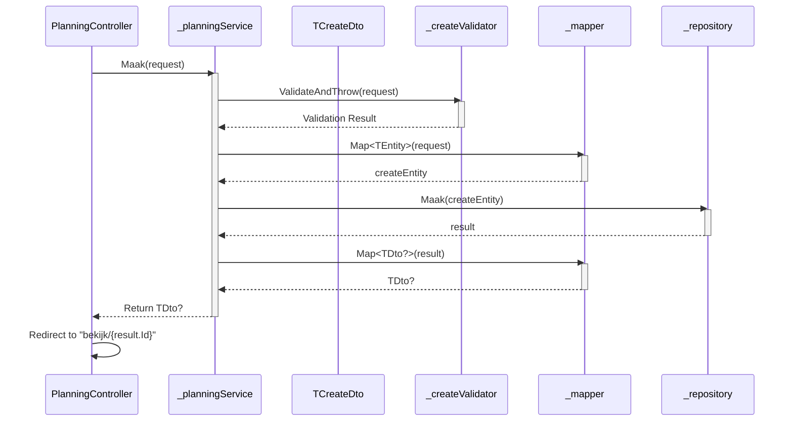

# Aanmaken lesplanning

```mermaid
sequenceDiagram
    participant PlanningController
    participant _planningService
    participant TCreateDto
    participant _createValidator
    participant _mapper
    participant _repository

    PlanningController->>_planningService: Maak(request)
    activate _planningService
    _planningService->>_createValidator: ValidateAndThrow(request)
    activate _createValidator
    _createValidator-->>_planningService: Validation Result
    deactivate _createValidator
    _planningService->>_mapper: Map<TEntity>(request)
    activate _mapper
    _mapper-->>_planningService: createEntity
    deactivate _mapper
    _planningService->>_repository: Maak(createEntity)
    activate _repository
    _repository-->>_planningService: result
    deactivate _repository
    _planningService->>_mapper: Map<TDto?>(result)
    activate _mapper
    _mapper-->>_planningService: TDto?
    deactivate _mapper
    _planningService-->>PlanningController: Return TDto?
    deactivate _planningService
    PlanningController->>PlanningController: Redirect to "bekijk/{result.Id}"

```