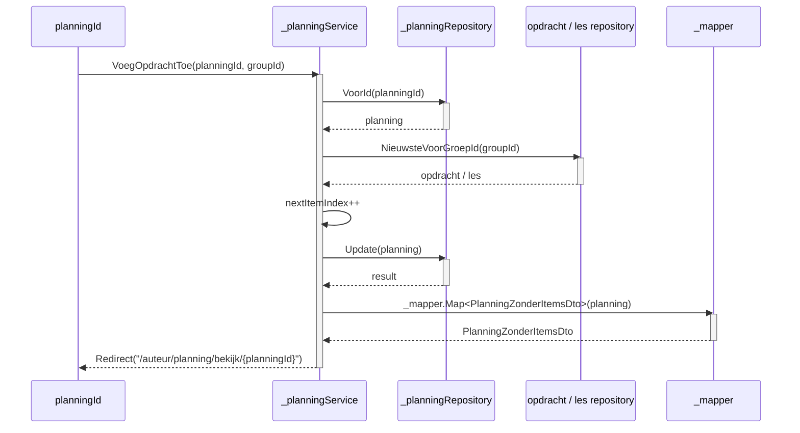

# Toevoegen onderwijsonderdeel aan planning 

```mermaid
sequenceDiagram
    participant HttpGet as planningId
    participant PlanningService as _planningService
    participant PlanningRepository as _planningRepository
    participant OpdrachtRepository as opdracht / les repository
    participant Mapper as _mapper

    HttpGet->>PlanningService: VoegOpdrachtToe(planningId, groupId)
    activate PlanningService
    PlanningService->>PlanningRepository: VoorId(planningId)
    activate PlanningRepository
    PlanningRepository-->>PlanningService: planning
    deactivate PlanningRepository
    PlanningService->>OpdrachtRepository: NieuwsteVoorGroepId(groupId)
    activate OpdrachtRepository
    OpdrachtRepository-->>PlanningService: opdracht / les
    deactivate OpdrachtRepository
    PlanningService->>PlanningService: nextItemIndex++
    PlanningService->>PlanningRepository: Update(planning)
    activate PlanningRepository
    PlanningRepository-->>PlanningService: result
    deactivate PlanningRepository
    PlanningService->>Mapper: _mapper.Map<PlanningZonderItemsDto>(planning)
    activate Mapper
    Mapper-->>PlanningService: PlanningZonderItemsDto
    deactivate Mapper
    PlanningService-->>HttpGet: Redirect("/auteur/planning/bekijk/{planningId}")
    deactivate PlanningService
```